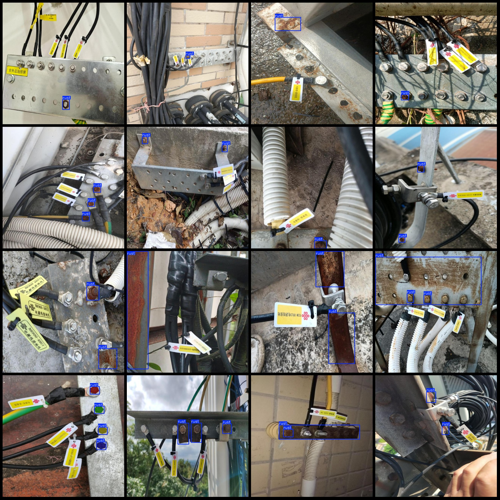

# Telecommunications Equipment and Facilities Corrosion and Rust Detection Data Set - VOC+YOLO Format - 1078 Instances, 1 Category

dataset format: Pascal VOC format+YOLO format
number of images: 1078  
annotation count: 1078  
annotation count: 1078  
annotationnumber of classes: 1  
Repository: firc-dataset
annotation class names:["rust"]  
boxes per class:   
rust box count = 2070  
total boxes: 2070  
image resolution: 640x640  
Dataset has enhancements: More than half of the images are enhanced.
Use annotation tool: labelImg.
Annotation rules: Draw a rectangle around the class.
Important notes: None.
Special statement: This dataset does not guarantee the accuracy of the trained models or weight files.
Annotation example:
## Images

Here is a pay link on Stripe ( https://buy.stripe.com/3cs8yP7sY87d0vu9AB ). Please contact me lonlonago@foxmail.com after funding $89, and I will send you a complete data files , thank you!

